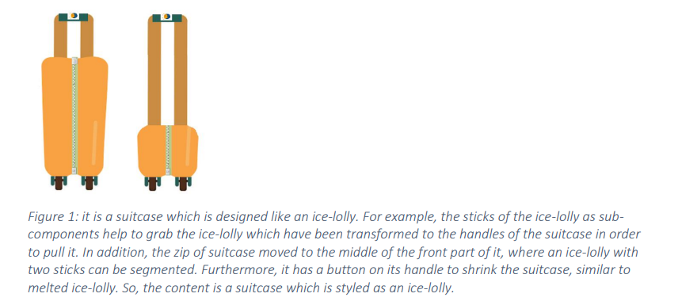

# SCAN
This is a pytorch reproduction of the paper [SCAN: Learning Hierarchical Compositional Visual Concepts, Higgins et al., ICLR 2018][SCAN]

This implementation is based on the [implementation][beta-VAE] of β-VAE and [implimentation][DAE] of SCAN.
The β-VAE model used in [DAE] is modified to utilize another DAE as reconstruction loss provider according to the paper.
I changed to make it working on my dataset (furniture dataset generated by Unity engine).

## Usage

### Dependencies
```
python 3.6
pytorch 0.4
visdom
numpy
```

### Running

By default, the working environment setting is `/data/hc/SCAN/` in `main.py` `--root_dir`, which should be modified for your convenience.
This is directory is supposed to contain the dataset in `root_dir/dataset/`, and is where checkpoint files and output files will be saved.

Dataset preparation is the same as [here](https://github.com/1Konny/FactorVAE).

To initialize visdom:

    visdom -port 6059

To reproduce the results of SCAN, please run the three `.sh` files one by one:

    sh scripts/DAE.sh
    sh scripts/beta_VAE.sh
    sh scripts/SCAN.sh

## Analysis
Symbol-Concept Association Network (SCAN) [1] addresses a learning framework of visual and textual concepts leveraging disentangled factors in an unsupervised fashion.  This approach claims the invention of the multimodal generator by a few pairs of symbols and images without imposing of specific symbol representation. Eventually, the presented paradigm leads to a bi-directional inference from symbols to scenes and vice versa. Moreover, since the representations of the visual primitives can traverse and combine in a tremendous variance, it is able to create unseen visual concepts. 
They propose a dataset using DeepMind Lab environment. [2] They use four variables (e.g., wall color, floor color, object color with 16 possible values and object types with 3 possible values) in a static viewpoint of a room containing a single object. In contrast to what they state for a wide range of setting such as spawn animation, horizontal camera rotation and the rotation of objects around the vertical axis, the two former changes have not been appeared clearly. The other shortcoming which threatens the fidelity of this dataset is that the vertical rotations are applied to the objects with symmetric shape, particularly. The results are not believed to be reasonable as they contend. The model is evaluated to completely fixed assigned scenes with walls, floor, and object. Therefore, they are annotated implicitly. Furthermore, when they aim to generate images from symbolic descriptions, they fill in the images just with the colors and the low-quality objects. To carry on further, they claim learning of unseen images; however, the new colors with RGB values (numerical, not conceptual) are generated, while the generation phase must include new types of object. The figure below shows the unseen concept of combination of ice-lolly style and suitcase content. (At least, they should have brought up a type by combining their shapes) Finally, in the opposite of the title, the model does not show any footprint of hierarchical modeling.



The more realistic dataset is CelebA [3] which SCAN is evaluated on by 40 attributes. These attributes mostly refer to pixels’ color such as smiling (i. e., some sort of white pixels in the nearly same positions), eyeglasses (black pixels), or bald (nude color). Additionally, all faces must be posed in the same orientation (pixels of eyes, lips, and so forth are in an almost similar spaces). 
The paper in [15] suggests that unsupervised learning is a chimera if biases in the model and data are undesired. SCAN’s authors approve that the testing shows biases such as “attractive” attribute in CelebA dataset. Furthermore, the cited work throws doubts that the high performance of SCAN is raised because of disentanglement. Additionally, the authors of [26] are skeptical about usefulness of model-based approach like SCAN for model-free agents. (I should mention it I could not understand the meaning of nature paper completely) 
Papers in [16,17] express an issue that SCAN can learn only the physical Symbol.
CelebA has been utilized in different sectors such as generative networks [4-11], face detectors and recognizers [12-14] and so on. 
Papers [18-20] exploit the approach in SCAN. Jaiswal et al in [21] employs SCAN to pre-process their dataset. The works in [22-24] train SCAN to provide a comparison. Also, the paper in [25] utilizes this approach as a part of image composition experiments.


### References:
[1] Higgins, I., Sonnerat, N., Matthey, L., Pal, A., Burgess, C.P., Bosnjak, M., Shanahan, M., Botvinick, M., Hassabis, D. and Lerchner, A., 2017. Scan: Learning hierarchical compositional visual concepts. arXiv preprint arXiv:1707.03389.[SCAN]
[2] Charles Beattie, Joel Z. Leibo, Denis Teplyashin, Tom Ward, Marcus Wainwright, Heinrich Küttler, Andrew Lefrancq, Simon Green, Víctor Valdés, Amir Sadik, Julian Schrittwieser, Keith Anderson, Sarah York, Max Cant, Adam Cain, Adrian Bolton, Stephen Gaffney, Helen King, Demis Hassabis, Shane Legg, and Stig Petersen. Deepmind lab. arXiv preprint arXiv:1612.03801, 2016.
[3] Z. Liu, P. Luo, X. Wang, and X. Tang. Deep learning face attributes in the wild. ICCV, 2015.
[4] Heusel, M., Ramsauer, H., Unterthiner, T., Nessler, B. and Hochreiter, S., 2017. Gans trained by a two time-scale update rule converge to a local nash equilibrium. Advances in neural information processing systems, 30.
[5] Karras, T., Aila, T., Laine, S. and Lehtinen, J., 2017. Progressive growing of gans for improved quality, stability, and variation. arXiv preprint arXiv:1710.10196.
[6] Chen, X., Duan, Y., Houthooft, R., Schulman, J., Sutskever, I. and Abbeel, P., 2016, December. Infogan: Interpretable representation learning by information maximizing generative adversarial nets. In Proceedings of the 30th International Conference on Neural Information Processing Systems (pp. 2180-2188).
[7] Choi, Y., Choi, M., Kim, M., Ha, J.W., Kim, S. and Choo, J., 2018. Stargan: Unified generative adversarial networks for multi-domain image-to-image translation. In Proceedings of the IEEE conference on computer vision and pattern recognition (pp. 8789-8797).
[8] Kim, T., Cha, M., Kim, H., Lee, J.K. and Kim, J., 2017, July. Learning to discover cross-domain relations with generative adversarial networks. In International Conference on Machine Learning (pp. 1857-1865). PMLR.
[9] Dumoulin, V., Belghazi, I., Poole, B., Mastropietro, O., Lamb, A., Arjovsky, M. and Courville, A., 2016. Adversarially learned inference. arXiv preprint arXiv:1606.00704.
[10] Berthelot, D., Schumm, T. and Metz, L., 2017. Began: Boundary equilibrium generative adversarial networks. arXiv preprint arXiv:1703.10717.
[11] Li, C. and Wand, M., 2016, October. Precomputed real-time texture synthesis with markovian generative adversarial networks. In European conference on computer vision (pp. 702-716). Springer, Cham.
[12] Zhang, K., Zhang, Z., Li, Z. and Qiao, Y., 2016. Joint face detection and alignment using multitask cascaded convolutional networks. IEEE Signal Processing Letters, 23(10), pp.1499-1503.
[13] Wen, Y., Zhang, K., Li, Z. and Qiao, Y., 2016, October. A discriminative feature learning approach for deep face recognition. In European conference on computer vision (pp. 499-515). Springer, Cham.
[14] Ranjan R, Patel VM, Chellappa R. Hyperface: A deep multi-task learning framework for face detection, landmark localization, pose estimation, and gender recognition. IEEE transactions on pattern analysis and machine intelligence. 2017 Dec 8;41(1):121-35.
[15] Locatello, F., Bauer, S., Lucic, M., Raetsch, G., Gelly, S., Schölkopf, B. and Bachem, O., 2019, May. Challenging common assumptions in the unsupervised learning of disentangled representations. In international conference on machine learning (pp. 4114-4124). PMLR.
[16] Kowadlo, G., Ahmed, A. and Rawlinson, D., 2019. AHA! an'Artificial Hippocampal Algorithm'for Episodic Machine Learning. arXiv preprint arXiv:1909.10340.
[17] Summerfield, C., Luyckx, F. and Sheahan, H., 2019. Structure learning and the parietal cortex.
[18] Wang, J., Zhang, W. and Yang, H., 2020, June. SCANViz: Interpreting the symbol-concept association captured by deep neural networks through visual analytics. In 2020 IEEE Pacific Visualization Symposium (PacificVis) (pp. 51-60). IEEE.
[19] Honke, G., Higgins, I., Thigpen, N., Miskovic, V., Link, K., Duan, S., Gupta, P., Klawohn, J. and Hajcak, G., 2020. Representation learning for improved interpretability and classification accuracy of clinical factors from EEG. arXiv preprint arXiv:2010.15274.
[20] Todo, K. and Yamamura, M., 2019. CONTRIBUTION OF INTERNAL REFLECTION IN LANGUAGE EMERGENCE WITH AN UNDER-RESTRICTED SITUATION.
[21] Jaiswal, A., Moyer, D., Ver Steeg, G., AbdAlmageed, W. and Natarajan, P., 2020, April. Invariant representations through adversarial forgetting. In Proceedings of the AAAI Conference on Artificial Intelligence (Vol. 34, No. 04, pp. 4272-4279).
[22] Sheng, H., Mo, H. and Mosengo, C.M.M.N., 2020. A Hippocampal-Entorhinal System Inspired Model for Visual Concept Representation. IEEE Transactions on Cognitive and Developmental Systems.
[23] Jiao, Y., Hare, J. and Prügel-Bennett, A., 2018. Probabilistic Semantic Embedding.
[24] Sheng, H., Mo, W. and Zhang, T., 2019, December. Bi-directional Generation between Attributes and Images. In Proceedings of the 2019 3rd International Conference on Computer Science and Artificial Intelligence (pp. 176-180).
[25] Montero, M.L., Ludwig, C.J., Costa, R.P., Malhotra, G. and Bowers, J., 2020, September. The role of disentanglement in generalisation. In International Conference on Learning Representations.
[26] Saxe, A., Nelli, S. and Summerfield, C., 2021. If deep learning is the answer, what is the question?. Nature Reviews Neuroscience, 22(1), pp.55-67.
[27] Lake, B. and Baroni, M., 2018, July. Generalization without systematicity: On the compositional skills of sequence-to-sequence recurrent networks. In International conference on machine learning (pp. 2873-2882). PMLR.
[28]Github Repo: [Pytorch implementation of β-VAE][beta-VAE] by [1Konny](https://github.com/1Konny)
[29]Github Repo: [PyTorch implimentation of DAE][DAE] by [Glaciohound](https://github.com/Glaciohound)

Note that there is a benchmark named SCAN in [27] which is unrelated to the proposed work here.


[SCAN]: https://arxiv.org/abs/1707.03389
[beta-VAE]: https://github.com/1Konny/Beta-VAE 
[DAE]: https://github.com/Glaciohound/SCAN
[issue]: https://github.com/miyosuda/scan/issues/1
